# Newsletter System Architecture Diagram

This diagram illustrates the connections between the newsletter management system, CHEFs (BC Gov Forms API), and CHES (BC Gov Email Service API).

```mermaid
graph TB
    subgraph "User Interface"
        UI1[newsletter_dashboard.php<br/>View/Manage Subscribers]
        UI2[send_newsletter.php<br/>Compose & Send]
        UI3[sync_subscriptions.php<br/>Trigger Sync]
        UI4[import_csv.php<br/>CSV Import]
        UI5[campaign_monitor.php<br/>Monitor Campaign]
    end

    subgraph "Database Layer"
        DB[(SQLite Database<br/>subscriptions.db)]
        T1[newsletters table]
        T2[subscriptions table]
        T3[subscription_history table]
        T4[email_queue table]
        T5[email_campaigns table]
        T6[last_sync table]
    end

    subgraph "CHEFs Integration<br/>(BC Gov Forms API)"
        CHEFS_API[CHEFs API<br/>submit.digital.gov.bc.ca]
        SYNC[manage_subscriptions.php<br/>Sync Script]
        FETCH["/api/form/{formId}/export<br/>GET Submissions"]
    end

    subgraph "CHES Integration<br/>(Email Service)"
        CHES_CLIENT[ches_client.php<br/>API Client]
        CHES_API[CHES API<br/>ches-dev.api.gov.bc.ca]
        TOKEN[OAuth2 Token Endpoint<br/>dev.loginproxy.gov.bc.ca]
        QUEUE_PROC[process_email_queue.php<br/>Cron Processor]
    end

    subgraph "Authentication"
        AUTH_CHEFS[Basic Auth<br/>Username:Password<br/>Encrypted]
        AUTH_CHES[OAuth2 Client Credentials<br/>CLIENT_ID:CLIENT_SECRET<br/>Environment Variables]
    end

    %% UI to Database
    UI1 --> DB
    UI2 --> DB
    UI3 --> DB
    UI4 --> DB
    UI5 --> DB

    %% Database tables
    DB --> T1
    DB --> T2
    DB --> T3
    DB --> T4
    DB --> T5
    DB --> T6

    %% CHEFs Flow
    UI3 -->|Triggers| SYNC
    SYNC -->|Reads Config| T1
    SYNC -->|HTTP GET| FETCH
    FETCH -->|Basic Auth| AUTH_CHEFS
    AUTH_CHEFS --> CHEFS_API
    CHEFS_API -->|JSON Submissions| SYNC
    SYNC -->|Parse & Store| T2
    SYNC -->|Log Actions| T3
    SYNC -->|Update Timestamp| T6

    %% CHES Flow - Queue Creation
    UI2 -->|Create Campaign| T5
    UI2 -->|Queue Emails| T4

    %% CHES Flow - Email Processing
    QUEUE_PROC -->|Cron Every Minute| T4
    QUEUE_PROC -->|Batch 30 emails| CHES_CLIENT
    CHES_CLIENT -->|Get Token| TOKEN
    TOKEN -->|OAuth2| AUTH_CHES
    AUTH_CHES -->|Access Token| CHES_CLIENT
    CHES_CLIENT -->|POST /email| CHES_API
    CHES_API -->|Transaction ID| CHES_CLIENT
    CHES_CLIENT -->|Update Status| T4
    QUEUE_PROC -->|Update Progress| T5

    %% CSV Import Flow
    UI4 -->|Bulk Insert| T2
    UI4 -->|Log Imports| T3

    %% Styling
    classDef uiClass fill:#e1f5ff,stroke:#01579b,stroke-width:2px
    classDef dbClass fill:#fff9c4,stroke:#f57f17,stroke-width:2px
    classDef chefsClass fill:#e8f5e9,stroke:#2e7d32,stroke-width:2px
    classDef chesClass fill:#fce4ec,stroke:#c2185b,stroke-width:2px
    classDef authClass fill:#f3e5f5,stroke:#6a1b9a,stroke-width:2px

    class UI1,UI2,UI3,UI4,UI5 uiClass
    class DB,T1,T2,T3,T4,T5,T6 dbClass
    class CHEFS_API,SYNC,FETCH chefsClass
    class CHES_CLIENT,CHES_API,TOKEN,QUEUE_PROC chesClass
    class AUTH_CHEFS,AUTH_CHES authClass
```

## Component Descriptions

### CHEFs (Common Hosted Forms) Integration
- **Trigger**: `sync_subscriptions.php` web UI
- **Processor**: `manage_subscriptions.php` script
- **API Endpoint**: `https://submit.digital.gov.bc.ca/app/api/v1/forms/{formId}/export`
- **Authentication**: Basic Auth (username/password encrypted in database)
- **Function**: Fetches form submissions containing subscribe/unsubscribe requests
- **Data Flow**:
  1. Read newsletter configuration from `newsletters` table
  2. Fetch submissions from CHEFs API using Basic Auth
  3. Parse email addresses and actions from submission data
  4. Update `subscriptions` table with active/unsubscribed status
  5. Log all actions to `subscription_history` table
  6. Update sync timestamp in `last_sync` table

### CHES (Common Hosted Email Service) Integration
- **Trigger**: `send_newsletter.php` web UI
- **Processor**: `process_email_queue.php` cron job (runs every minute)
- **API Client**: `ches_client.php` wrapper class
- **API Endpoint**: `https://ches-dev.api.gov.bc.ca/api/v1/email`
- **Authentication**: OAuth2 Client Credentials (environment variables)
- **Rate Limit**: 30 emails per minute
- **Data Flow**:
  1. User creates campaign and queues emails via web UI
  2. Campaign stored in `email_campaigns` table
  3. Individual emails queued in `email_queue` table
  4. Cron processor fetches pending emails (batch of 30)
  5. Get OAuth2 access token from `dev.loginproxy.gov.bc.ca`
  6. Send each email via CHES API
  7. Update queue status and transaction IDs
  8. Update campaign progress and completion status

### Database Schema
- **newsletters**: Configuration for each newsletter (form ID, API credentials, settings)
- **subscriptions**: Current subscriber list with status (active/unsubscribed)
- **subscription_history**: Audit log of all subscribe/unsubscribe actions
- **email_queue**: Pending/sent email queue for rate-limited processing
- **email_campaigns**: Campaign metadata and sending progress
- **last_sync**: Tracks last successful sync with CHEFs API

### Authentication Methods
- **CHEFs**: Basic Authentication (username:password, encrypted at rest)
- **CHES**: OAuth2 Client Credentials flow (CLIENT_ID:CLIENT_SECRET in environment)
